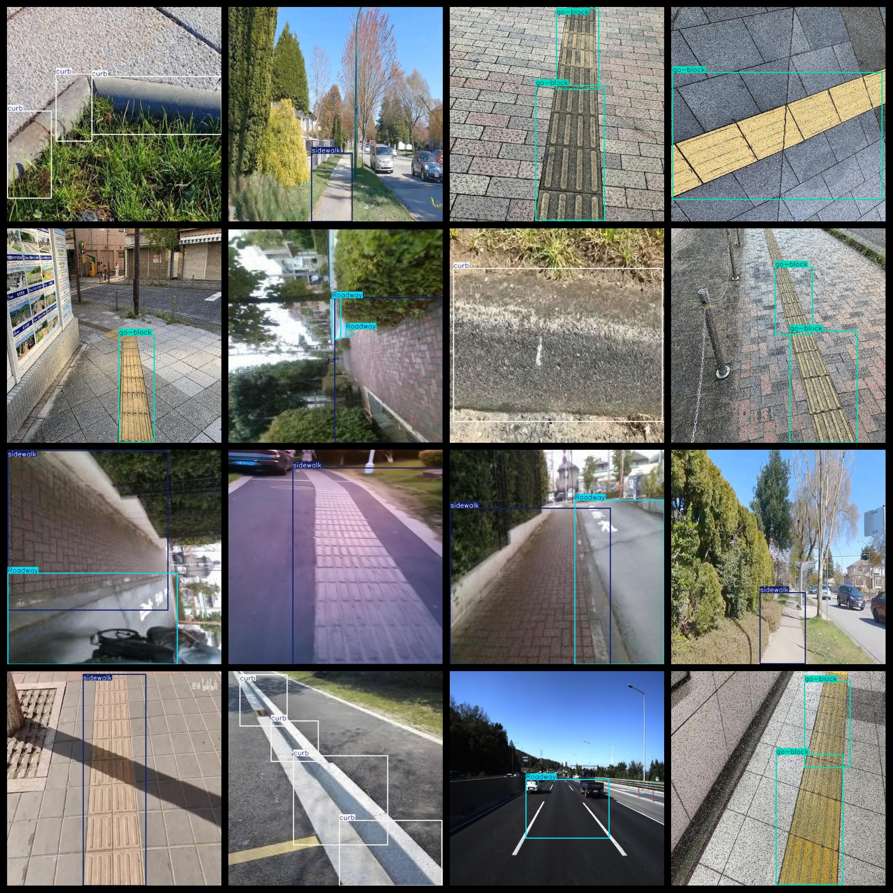
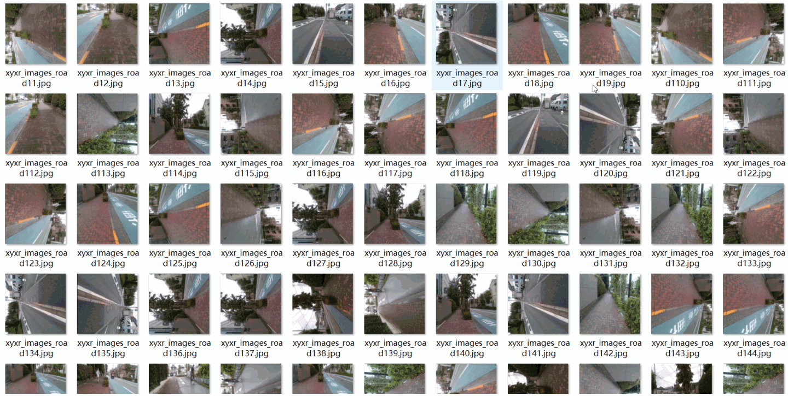

# [Object Detection] main road Person Sidewalk Blind etc Road Detection Dataset 5328 imagesYOLO+VOC (Augmented)

The dataset format consists of VOC format and YOLO format. It is packaged into three folders: JPEGImages, Annotations, and labels.

In the JPEGImages folder, there are a total of 5328 jpg images.

In the Annotations folder, there are a total of 5328 xml files.

In the labels folder, there are a total of 5328 txt files.

There are a total of 5 label categories: ["BikeRoad", "Roadway", "curb", "go-block", "sidewalk"].

For each label category, there are a total of 9045 bounding box numbers.

The image resolution is clear.

The images have been enhanced.

The shape of the labels is rectangular boxes, used for target detection recognition.

Special notice: The dataset does not guarantee the accuracy or reasonableness of the trained models or weight files. The dataset only provides accurate and reasonable annotations.

Annotation example:

## Images

---

Here is a pay link on Stripe (https://buy.stripe.com/3cs8yP7sY87d0vu9AB). Please contact me lonlonago@foxmail.com after funding $89, and I will send you a complete data files, thank you!

